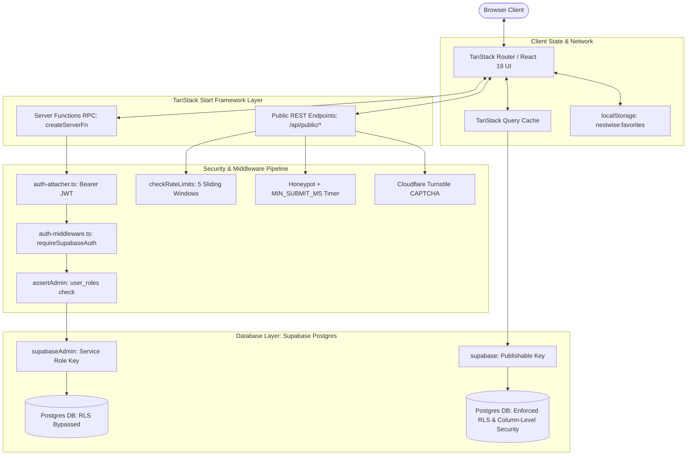
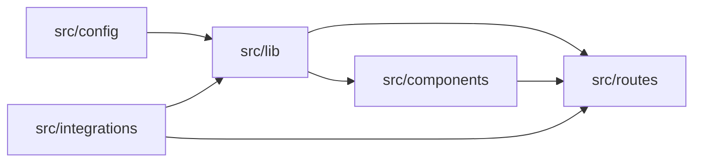
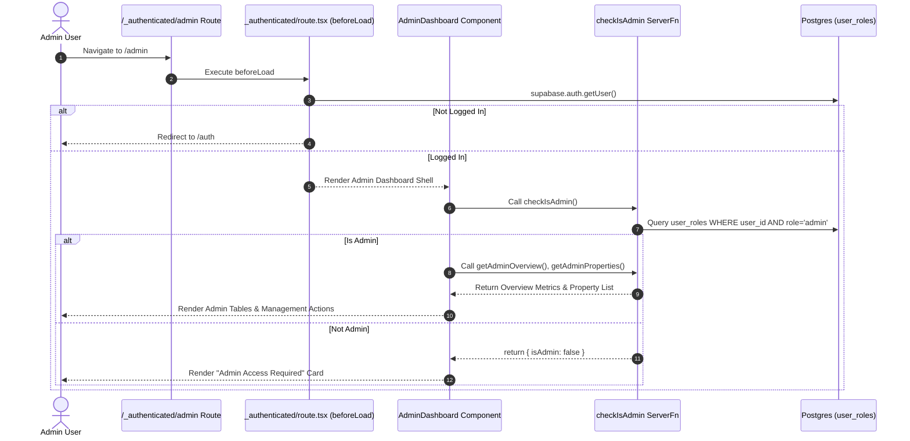
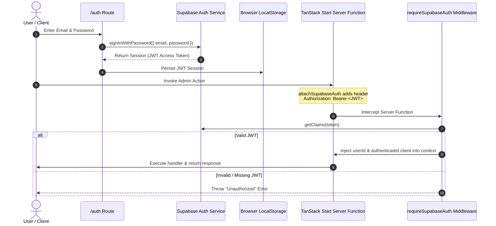
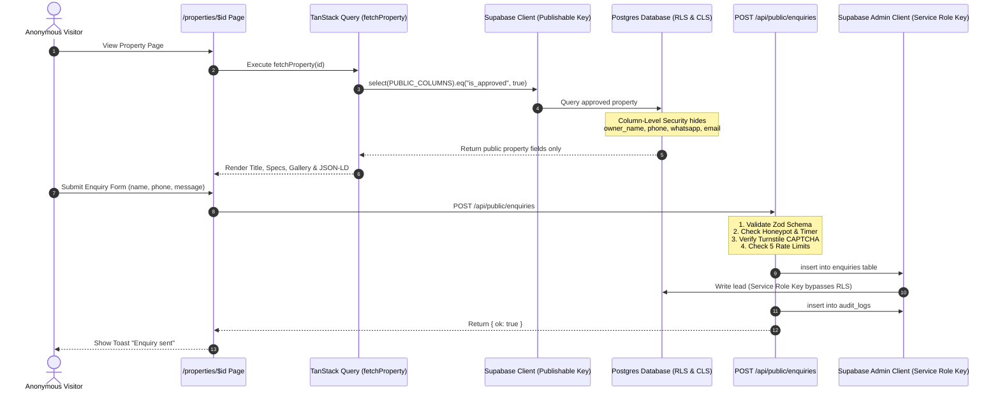

# Urban Rental Flats (URF) — Complete Project Analysis

> **Project Analysis Report**  
> **Repository:** `property-pioneer-dev`  
> **Lead Software Architect Analysis**  
> **Status:** Codebase Audit & Architectural Blueprint Complete (No Code Modified)

---

## Executive Summary

Urban Rental Flats (URF) is a high-performance, modular, API-first real-estate platform engineered on **TanStack Start** (Vite + React 19 SSR) and **Supabase** (Postgres + Row-Level Security + Auth).

The platform is designed around a 5-layer security-first architecture. It features anonymous public listing browsing, local storage favoriting, server-side anti-abuse lead processing (honeypot, submit timing, rate-limiting, Turnstile CAPTCHA), and an authenticated admin dashboard powered by server function RPCs.

---

## 1. Complete Project Structure

```text
property-pioneer-dev/
├── README.md                          # Repository documentation & Lovable sync info
├── ARCHITECTURE.md                    # Platform architecture specification & security baseline
├── package.json                       # Core dependencies (React 19, TanStack Start/Router, Supabase, Tailwind v4)
├── vite.config.ts                     # Vite build & TanStack Router configuration
├── tsconfig.json                      # TypeScript path aliases (@/* -> ./src/*)
├── bun.lock / bunfig.toml             # Lockfile & package manager config
├── eslint.config.js / .prettierrc     # Linting and formatting rules
├── supabase/
│   ├── config.toml                    # Supabase local environment configuration
│   └── migrations/                    # SQL Database schema & security migration scripts
│       ├── 20260728193751_...sql      # Schema init: properties table, enums, initial seed data
│       ├── 20260729052711_...sql      # Column-level security: REVOKE owner contact columns from public
│       ├── 20260729094121_...sql      # Enquiries table with service-role access
│       ├── 20260729184046_...sql      # Audit logs table with service-role access
│       ├── 20260730043953_...sql      # RLS refinement for approved properties
│       ├── 20260730044133_...sql      # Deny-all RLS policies on enquiries and audit_logs
│       ├── 20260804175920_...sql      # user_roles table, app_role enum, has_role function
│       ├── 20260804175948_...sql      # Security definer function permission adjustment
│       └── 20260805070818_...sql      # Final revoke of has_role from public/anon
└── src/
    ├── server.ts                      # Nitro / SSR entry handler & h3 error normalizer
    ├── start.ts                       # TanStack Start instance, CSRF middleware & auth attacher
    ├── router.tsx                     # TanStack Router instance & QueryClient provider factory
    ├── routeTree.gen.ts               # Auto-generated TanStack Router route tree
    ├── styles.css                     # Global styles, Tailwind imports, CSS design tokens
    ├── assets/                        # Static hero images & branding assets
    ├── config/                        # Platform Switchboard & Core Data Configurations
    │   ├── features.ts                # Feature Switchboard (~100+ feature flags across 10 domains)
    │   ├── platform.ts                # Expansion data (cities, states, locales, monetization SKUs)
    │   └── rbac.ts                    # Role-Based Access Control matrix & permission mapping
    ├── integrations/                  # Database & Auth Integrations
    │   └── supabase/
    │       ├── client.ts              # Client-side Supabase client proxy (Publishable Key)
    │       ├── client.server.ts       # Server-side Supabase Admin client (Service Role Key)
    │       ├── auth-middleware.ts     # TanStack Start server RPC authentication middleware
    │       ├── auth-attacher.ts       # Client middleware auto-attaching Bearer JWT to RPC calls
    │       └── types.ts               # Auto-generated TypeScript database definitions
    ├── lib/                           # Core Domain Logic & Security Primitives
    │   ├── properties.ts              # Property types, query fetchers, price formatters
    │   ├── enquiries.ts               # Zod validation schema for leads, client submission helper
    │   ├── useFavorites.ts            # Custom React hook for localStorage wishlist management
    │   ├── security.server.ts         # Rate limiting engine, audit logger, IP parser, Turnstile validator
    │   ├── admin.functions.ts         # TanStack Start createServerFn RPC endpoints for admin
    │   ├── admin.server.ts            # Server-only admin query loaders & mutation logic
    │   ├── error-capture.ts           # SSR unhandled error interception
    │   ├── error-page.ts              # Fallback HTML error page generator
    │   ├── lovable-error-reporting.ts # Error logging bridge
    │   └── utils.ts                   # Tailwind class merge helper (cn)
    ├── components/                    # UI Components
    │   ├── BrandMark.tsx              # Brand logo & mark component
    │   ├── PropertyCard.tsx           # Reusable property card with lazy image & favorite button
    │   ├── TurnstileWidget.tsx        # Cloudflare Turnstile CAPTCHA component
    │   └── ui/                        # 46 Radix UI / Shadcn primitives (button, card, dialog, table, etc.)
    └── routes/                        # File-Based TanStack Router Hierarchy
        ├── __root.tsx                 # Root layout with navbar, footer, auth state listener, query provider
        ├── index.tsx                  # Homepage with hero, search bar, popular cities, featured grid
        ├── properties.tsx             # Parent search route with Zod search schema validation
        ├── properties.index.tsx       # Property search & filtering page
        ├── properties.$id.tsx         # Property detail page with gallery, specs, enquiry modal, JSON-LD
        ├── favorites.tsx              # Saved homes view
        ├── auth.tsx                   # Email/Password Sign in and Sign up page
        ├── sitemap[.]xml.ts           # Dynamic XML sitemap generator
        ├── $.tsx                      # 404 Not Found fallback route
        └── _authenticated/            # Authenticated route layout (auth guard beforeLoad)
            ├── route.tsx              # Session check beforeLoad redirect guard
            └── admin.tsx              # Admin Dashboard (Overview, Listings, Enquiries, Audit logs)
```

---

## 2. Platform Architecture

The system operates on a **Full-Stack Modular, API-First SSR Architecture**:



---

## 3. Technology Stack & Key Subsystems

| Layer                     | Technology                                      | Usage / Implementation                                |
| ------------------------- | ----------------------------------------------- | ----------------------------------------------------- |
| **Frontend Core**         | React 19 + TypeScript                           | UI rendering with React 19 compiler features          |
| **Meta-Framework**        | TanStack Start + Vite 8                         | Full-stack SSR framework with server functions        |
| **Routing**               | TanStack React Router                           | File-based, type-safe route loader & search params    |
| **Server Engine**         | Nitro / h3                                      | Server entry runner handling SSR requests             |
| **Database & Auth**       | Supabase (Postgres)                             | Hosted relational DB with Row & Column Level Security |
| **Data Fetching / Cache** | `@tanstack/react-query`                         | Server state caching and query invalidation           |
| **Styling & UI**          | Tailwind CSS v4 + Radix UI                      | Utility-first CSS & accessible UI primitives          |
| **Validation**            | Zod + `@tanstack/zod-adapter`                   | Schema validation for search, forms, and RPCs         |
| **Anti-Abuse / Security** | Cloudflare Turnstile + Postgres sliding windows | CAPTCHA, rate-limiting, honeypot, audit logs          |

---

## 4. Folder Dependency Map

- `src/config/` is independent with zero external application dependencies.
- `src/integrations/supabase/` handles initialization of client/server DB connectors and auth middleware.
- `src/lib/` imports from `config` and `integrations/supabase` to build business logic and RPC endpoints.
- `src/components/` imports from `src/lib` and `src/components/ui`.
- `src/routes/` acts as the composition layer, orchestrating components, routes, RPCs, and query options.



---

## 5. Discrepancies, Unused Files & Code Smells

> [!WARNING]
> **Documentation Discrepancy (README vs Codebase)**  
> `README.md` describes a Next.js + Prisma/Drizzle + Cloudinary project. However, the repository has been implemented using **TanStack Start**, **Vite**, **Supabase JS**, and **Radix UI**. The README represents a legacy prompt template and should be updated.

> [!NOTE]
> **Unused UI Primitives**  
> `src/components/ui/` contains 46 component files generated during initial scaffolding. Many primitives (such as `calendar.tsx`, `chart.tsx`, `context-menu.tsx`, `drawer.tsx`, `menubar.tsx`, `resizable.tsx`, `sidebar.tsx`, `toggle-group.tsx`) are currently unreferenced by any route.

> [!IMPORTANT]
> **Branding Naming Collision**  
> `useFavorites.ts` stores saved properties under the `localStorage` key `"nestwise:favorites"`, while the application branding throughout the codebase is `"Urban Rental Flats"` (URF).

---

## 6. Bugs & Performance Bottlenecks

1. **Client-Side Filtering Memory Bottleneck**:
   - `fetchProperties()` (`src/lib/properties.ts`) retrieves all approved properties from Postgres in a single query. `properties.index.tsx` performs search filtering in browser memory using JavaScript `useMemo`. As the listing database grows beyond a few hundred records, payload sizes will increase dramatically and harm Core Web Vitals (LCP/INP).
2. **Server Memory Overhead in Admin Overview**:
   - `loadOverview()` in `src/lib/admin.server.ts` fetches all rows of `properties` and `enquiries` into Node server memory to compute totals and counts using `.filter()`. Database-level aggregation queries (`COUNT(*)`, `GROUP BY city`) should be used instead.
3. **Sub-optimal Admin Authorization Route Guard**:
   - `_authenticated/route.tsx` only validates that a session exists (`supabase.auth.getUser()`). The role check (`checkIsAdmin`) occurs inside the UI component of `/admin` via `useQuery`. Unprivileged logged-in users can mount the route before receiving the "Admin access required" message.
4. **Multiple Sequential Rate-Limit SQL Queries**:
   - Submitting an enquiry triggers 5 separate sequential Postgres count queries in `src/routes/api/public/enquiries.ts`, adding ~150-300ms latency to every lead submission.

---

## 7. Subsystem Deep-Dives

### 7.1 Admin Dashboard Workflow



### 7.2 Authentication & Security Flow



### 7.3 Property Listing Data Flow



---

## 8. Improvement Opportunities & Strategic Recommendations

### High Priority (Security & Reliability)

1. **Move Admin Role Check to Route `beforeLoad`**:
   - Update `src/routes/_authenticated/route.tsx` to check `user_roles` inside `beforeLoad` before rendering the child routes, preventing unauthorized users from accessing the admin bundle.
2. **Standardize LocalStorage Keys**:
   - Rename `nestwise:favorites` in `useFavorites.ts` to `urf:favorites` to align with the platform name.

### Medium Priority (Performance & Scaling)

3. **Database Server-Side Search & Pagination**:
   - Replace client-side filtering in `properties.index.tsx` with Supabase server-side query parameters (`.ilike()`, `.eq()`, `.range(offset, limit)`).
4. **Postgres Aggregations for Admin Dashboard**:
   - Refactor `loadOverview()` in `admin.server.ts` to use SQL `COUNT()` and `GROUP BY` instead of pulling full table rows into Node.js memory.

### Low Priority (Future Phase Preparedness)

5. **Clean Up Unused UI Primitives**:
   - Remove unused scaffolding components from `src/components/ui/` to reduce repository bloat.
6. **Update Repository Documentation**:
   - Refresh `README.md` to accurately document the TanStack Start + Supabase + Tailwind v4 architecture.
