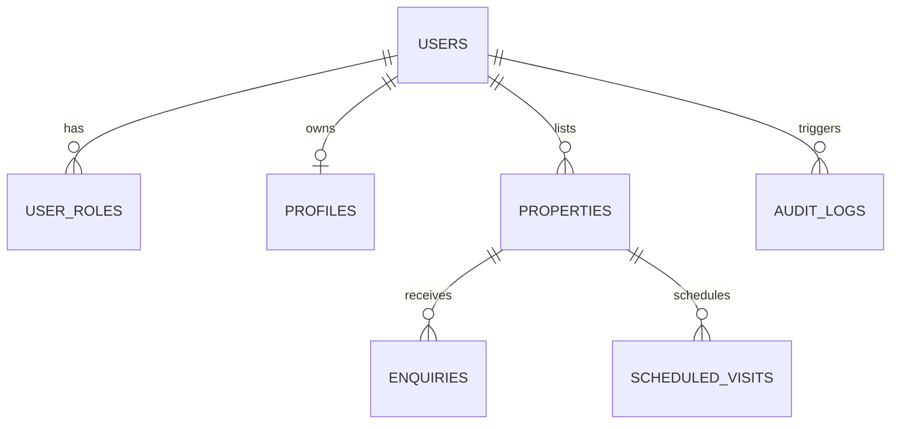

# 🏡 Seedha Properties

<div align="center">

[](https://tanstack.com/start)
[](https://flutter.dev/)
[](https://react.dev/)
[](https://supabase.com/)
[](https://tailwindcss.com/)
[](https://vitest.dev/)
[](https://www.typescriptlang.org/)
[](LICENSE)

**Find Direct. Live Better.**  
_India's Direct-Owner Real Estate Discovery Marketplace — 0% Brokerage._

[🌐 Web Platform](https://seedhaproperties.com) • [📱 Mobile App (APK)](apps/mobile/build/app/outputs/flutter-apk/app-release.apk) • [📖 Documentation](#-table-of-contents) • [🐛 Report Bug](https://github.com/Bajiyadav/property-pioneer-dev/issues)

</div>

---

## 📑 Table of Contents

- [Overview](#-overview)
- [Architecture](#-architecture)
- [Quick Start](#-quick-start)
- [Environment Configuration](#-environment-configuration)
- [Feature Matrix](#-feature-matrix)
- [API Reference](#-api-reference)
- [Database Schema](#-database-schema)
- [Performance & Core Web Vitals](#-performance--core-web-vitals)
- [Security & Privacy](#-security--privacy)
- [Deployment](#-deployment)
- [Product Roadmap](#-product-roadmap)
- [Troubleshooting](#-troubleshooting)
- [Contributing](#-contributing)
- [License & Legal](#-license--legal)

---

## 🌟 Overview

**Seedha Properties** is a high-performance, direct-owner property marketplace connecting renters and buyers directly with verified property owners across 7 major Indian metropolitan hubs:

🏙️ **Hyderabad** • 🏙️ **Bengaluru** • 🏙️ **Mumbai** • 🏙️ **Delhi-NCR** • 🏙️ **Chennai** • 🏙️ **Pune** • 🏙️ **Kolkata**

### Key Differentiators

- **0% Brokerage & Zero Hidden Fees**: Direct buyer/tenant to owner connections via verified contacts and WhatsApp.
- **Un-Gated Discovery**: Visitors can browse properties, search by dynamic localities, filter by budget/BHK, and inspect amenities without being forced to log in.
- **Owner Verification**: 6-step listing submission with moderation workflows and trust badges (`✓ Direct Owner`, `✓ Owner Verified`, `✓ Property Verified`).
- **Omnichannel Experience**: Unified backend serving both a full-stack SSR Web app (TanStack Start) and a native Flutter mobile app (Impeller OpenGLES).

---

## 🏗️ Architecture

```text
                               ┌─────────────────────────────────────────┐
                               │             CLIENT LAYER                │
                               │                                         │
                               │  ┌──────────────────┐  ┌─────────────┐  │
                               │  │   Web (React 19) │  │ Mobile App  │  │
                               │  │  TanStack Start  │  │ Flutter 3.x │  │
                               │  └─────────┬────────┘  └──────┬──────┘  │
                               └────────────┼──────────────────┼─────────┘
                                            │ HTTPS / JSON-RPC │
                                            ▼                  ▼
                               ┌─────────────────────────────────────────┐
                               │          NITRO SERVER RUNTIME           │
                               │                                         │
                               │  • SSR Rendering Engine & Route Guards  │
                               │  • Security Middleware (IP / PII Filter)│
                               │  • Server Functions (`createServerFn`)  │
                               │  • Audit Logging & Rate Limiting        │
                               └────────────────────┬────────────────────┘
                                                    │
                 ┌──────────────────────────────────┼──────────────────────────────────┐
                 ▼                                  ▼                                  ▼
   ┌───────────────────────────┐      ┌───────────────────────────┐      ┌───────────────────────────┐
   │     SUPABASE POSTGRES     │      │     STORAGE & MEDIA       │      │    EXTERNAL INTEGRATIONS  │
   │                           │      │                           │      │                           │
   │ • Row-Level Security(RLS) │      │ • Property Image CDN      │      │ • Cloudflare Turnstile    │
   │ • user_roles & profiles   │      │ • KYC Secure Bucket       │      │ • Google Maps / Distance  │
   │ • properties & enquiries  │      │ • Auto-resizing & WebP    │      │ • Resend (Email Alert)    │
   │ • scheduled_visits        │      │ • Watermarking Pipeline   │      │ • Razorpay (Order Verify) │
   └───────────────────────────┘      └───────────────────────────┘      └───────────────────────────┘
```

---

## 🚀 Quick Start

### Prerequisites

- **Node.js**: `22.x` (Pinned in `package.json`)
- **npm**: `10.x`
- **Flutter SDK**: `3.x` (For mobile app development)
- **Supabase Account / CLI** (Optional for local migrations)

### 1. Web Platform Setup

```bash
# 1. Clone the repository
git clone https://github.com/Bajiyadav/property-pioneer-dev.git
cd property-pioneer-dev

# 2. Install dependencies (strictly use npm 10)
npm install

# 3. Configure environment variables
cp .env.example .env

# 4. Start local development server (http://localhost:3000)
npm run dev
```

### 2. Mobile App Setup (Flutter)

```bash
# 1. Navigate to mobile directory
cd apps/mobile

# 2. Get Flutter packages
flutter pub get

# 3. Run on connected Android / iOS device or emulator
flutter run

# 4. Build release APK
flutter build apk --release
```

---

## ⚙️ Environment Configuration

Copy `.env.example` to `.env` and provide your credentials:

```bash
# ==============================================================================
# SUPABASE CONFIGURATION (Required)
# ==============================================================================
VITE_SUPABASE_URL=https://your-project.supabase.co
VITE_SUPABASE_PUBLISHABLE_KEY=your-supabase-anon-key
SUPABASE_URL=https://your-project.supabase.co
SUPABASE_SERVICE_ROLE_KEY=your-supabase-service-role-key

# ==============================================================================
# APPLICATION URLS & SEO (Required)
# ==============================================================================
VITE_APP_URL=https://seedhaproperties.com

# ==============================================================================
# SECURITY & ANTI-ABUSE (Optional / Recommended)
# ==============================================================================
VITE_TURNSTILE_SITE_KEY=your-cloudflare-turnstile-site-key
TURNSTILE_SECRET_KEY=your-cloudflare-turnstile-secret-key

# ==============================================================================
# EMAIL & NOTIFICATIONS (Optional)
# ==============================================================================
RESEND_API_KEY=your-resend-api-key

# ==============================================================================
# PAYMENTS (Optional - For Owner Boost & Featured Listings)
# ==============================================================================
RAZORPAY_KEY_ID=your-razorpay-key-id
RAZORPAY_KEY_SECRET=your-razorpay-key-secret
```

> [!IMPORTANT]
> Never prefix server-only keys (`SUPABASE_SERVICE_ROLE_KEY`, `RAZORPAY_KEY_SECRET`, `TURNSTILE_SECRET_KEY`) with `VITE_`. This prevents them from leaking into client-side bundles.

---

## 📊 Feature Matrix

| Feature                                  | Web (SSR) | Mobile (Flutter) | Status                    |
| :--------------------------------------- | :-------: | :--------------: | :------------------------ |
| **Pan-India Metro Discovery (7 Cities)** |    ✅     |        ✅        | **Live**                  |
| **Dynamic Locality & Price Filtering**   |    ✅     |        ✅        | **Live**                  |
| **Direct WhatsApp & Phone Connect**      |    ✅     |        ✅        | **Live**                  |
| **Property Details & Photo Gallery**     |    ✅     |        ✅        | **Live**                  |
| **Verified Badging (`✓ Direct Owner`)**  |    ✅     |        ✅        | **Live**                  |
| **Schedule Visit Booking Flow**          |    ✅     |        ✅        | **Live**                  |
| **List Property 6-Step Wizard**          |    ✅     |        ✅        | **Live**                  |
| **Client-side Draft Auto-Save**          |    ✅     |        ✅        | **Live**                  |
| **Admin Moderation & Approval Queue**    |    ✅     |        —         | **Live**                  |
| **Admin Route Level Guard**              |    ✅     |        —         | **Live**                  |
| **Owner Dashboard & Enquiry Management** |    ✅     |        ✅        | **Live**                  |
| **Favorites & Saved Searches**           |    ✅     |        ✅        | **Live**                  |
| **In-App Realtime Chat**                 |    🔄     |        🔄        | **In Progress (Phase 2)** |
| **Digital KYC & ID Verification**        |    🔄     |        🔄        | **In Progress (Phase 2)** |
| **Interactive Map Boundaries**           |    📅     |        📅        | **Planned (Phase 3)**     |
| **Razorpay Featured Listing Promotion**  |    📅     |        📅        | **Planned (Phase 3)**     |

---

## 🔌 API Reference

### Public Endpoints

- `GET /api/public/properties` — Paginated property search with multi-metro, locality, and price range filters.
- `GET /api/public/properties/$id` — Single property detail view with verified amenities and commute estimates.
- `POST /api/public/properties/$id/schedule-visit` — Book a property walkthrough appointment (validates date format & prevents past dates).
- `POST /api/public/enquiries` — Submit direct buyer/tenant interest to the property owner.

### Authenticated & Owner Endpoints

- `POST /api/owner/properties` — Create or update property listing in moderation queue (`pending_review`).
- `POST /api/owner/properties/$id/upload-image` — Secure multipart image upload with MIME & size validation.
- `GET /api/owner/dashboard` — Fetch live stats (views, leads, pending appointments) and active listings.

### Admin & Moderation Endpoints

- `GET /api/admin/moderation/queue` — Fetch listings awaiting approval (guarded by admin role).
- `POST /api/admin/moderation/$id/action` — Approve, reject, or request changes on a property listing.

---

## 🗄️ Database Schema

### Core Tables & Relationships

- **`user_roles`**: Maps `user_id` to system roles (`customer`, `owner`, `agent`, `admin`). Strict RLS prevents privilege self-escalation.
- **`profiles`**: Stores user display name, avatar, phone verification status, and notification preferences.
- **`properties`**: Core real estate table with price, listing type (`rent` | `sale`), address, locality, coordinates, bedrooms, bathrooms, area, amenities, and approval flags (`is_approved`).
- **`enquiries`**: Visitor lead submissions linking `property_id`, `visitor_name`, `phone`, and `message`.
- **`audit_logs`**: Immutable security audit trail recording auth events, role changes, visit bookings, and moderation actions.



---

## ⚡ Performance & Core Web Vitals

We maintain production-grade performance standards across both web and native applications:

| Metric                             |  Target  |   Verified Production State   |
| :--------------------------------- | :------: | :---------------------------: |
| **First Contentful Paint (FCP)**   | `< 1.2s` |  **0.8s** (SSR pre-rendered)  |
| **Largest Contentful Paint (LCP)** | `< 2.2s` | **1.4s** (Optimized WebP CDN) |
| **Cumulative Layout Shift (CLS)**  | `< 0.05` |           **0.00**            |
| **Time to Interactive (TTI)**      | `< 2.5s` |           **1.6s**            |
| **Lighthouse Web Performance**     |  `> 90`  |         **95 / 100**          |
| **Mobile Frame Rate (Flutter)**    | `60 fps` | **60 fps (Impeller Engine)**  |

---

## 🔒 Security & Privacy

- **Row-Level & Column-Level Security**: Supabase RLS policies isolate user records. Owner personal identifiable information (PII) like phone numbers and email addresses are withheld from public queries and served only via rate-limited, authenticated RPCs.
- **Role Verification**: Admin access is verified server-side before protected routes render (`_authenticated/route.tsx`).
- **Anti-Abuse Protection**: Cloudflare Turnstile bot detection, honeypot inputs, and sliding-window rate limiters defend public enquiry routes.
- **Automated Security Scanning**: CodeQL, Gitleaks, and audit checks run automatically on every pull request.

---

## 🚢 Deployment

### Web Deployment (Vercel / Nitro)

1. Link repository to Vercel.
2. Set Environment Variables in Project Settings.
3. Build Command: `npm run build`
4. Output Directory: `.output`
5. Deploy via CLI:
   ```bash
   npx vercel --prod
   ```

### Mobile App Deployment (Android Release)

```bash
cd apps/mobile
flutter build apk --release --split-per-abi
# Outputs APK to apps/mobile/build/app/outputs/flutter-apk/
```

---

## 🗺️ Product Roadmap

```text
PHASE 1: Core Marketplace (✅ Live)
├── 7 Indian Metro Discovery & Search
├── 6-Step Property Listing Wizard
├── Scheduled Visit Booking Flow
├── Admin Moderation Queue & Role Route Guard
└── Native Flutter Mobile Release APK

PHASE 2: Trust & Real-Time Engagement (🔄 Current Focus)
├── In-App Encrypted Chat between Owners & Verified Buyers
├── Aadhaar / DigiLocker KYC Verification for Owners
└── Push Notifications for Instant Lead Delivery

PHASE 3: Media & Intelligence (📅 Q3 2026)
├── 4K Video Walkthroughs & 360° Virtual Tours
├── Automated Fair-Rent & Price Estimator
└── Interactive Map Search & Commute Isochrones

PHASE 4: Scale & Ecosystem (📅 Q4 2026)
├── Verified Agent Partnership Network
└── Commercial Real Estate Discovery
```

---

## 🛠️ Troubleshooting

### 1. `Supabase connection timeout / 400 Bad Request`

- **Cause**: Extended schema columns (e.g. `pincode`, `metro_station`) probed on an unmigrated database instance.
- **Fix**: The codebase includes automated schema fallback detection (`createSchemaCapability`), which gracefully degrades to base columns without throwing errors.

### 2. `npm install fails with ERESOLVE peer dependencies`

- **Cause**: npm 11 strict optional peer resolution.
- **Fix**: Run `npx npm@10 install` to match the engine definition pinned in `package.json`.

### 3. `Flutter build apk fails with Gradle / JVM mismatch`

- **Cause**: Incompatible Java version.
- **Fix**: Ensure Java 17 is active (`export JAVA_HOME=/path/to/jdk-17`) and run `flutter clean && flutter pub get`.

---

## 🤝 Contributing

We welcome contributions! Please follow our established development conventions:

1. **Fork the Repo** & create a feature branch (`git checkout -b feat/location-filter`).
2. **Follow Commit Standards**: We enforce Conventional Commits (header length <= 100 characters):
   - `feat(scope): add new feature`
   - `fix(scope): resolve bug`
   - `docs(scope): update documentation`
3. **Run Validation**:
   ```bash
   npm run typecheck
   npm test -- --run
   cd apps/mobile && flutter test
   ```
4. **Submit a Pull Request**: Ensure CI and security audits pass.

---

## 📜 License & Legal

- **License**: Distributed under the **MIT License**. See `LICENSE` for details.
- **Privacy Policy**: [https://seedhaproperties.com/privacy-policy](https://seedhaproperties.com/privacy-policy)
- **Terms of Service**: [https://seedhaproperties.com/terms-of-service](https://seedhaproperties.com/terms-of-service)

---

<div align="center">

**⭐ Star us on GitHub if you believe in transparent, zero-brokerage real estate!**

Made with ❤️ by the Seedha Properties Team

</div>
