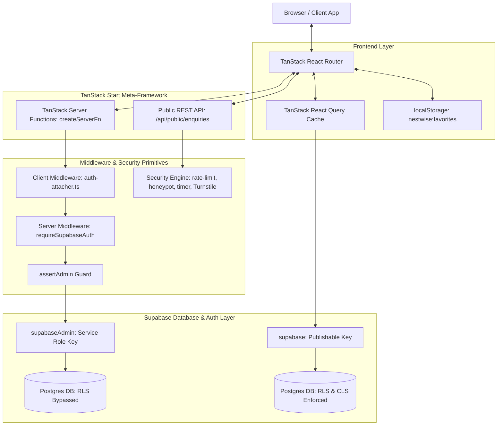
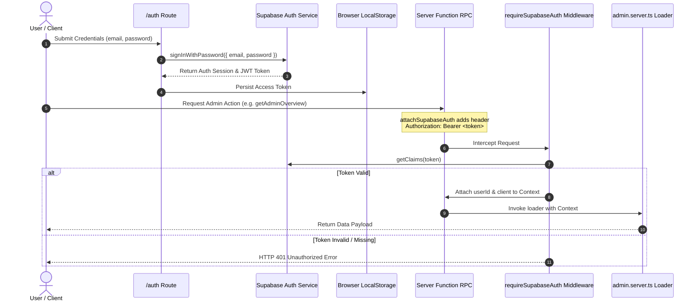
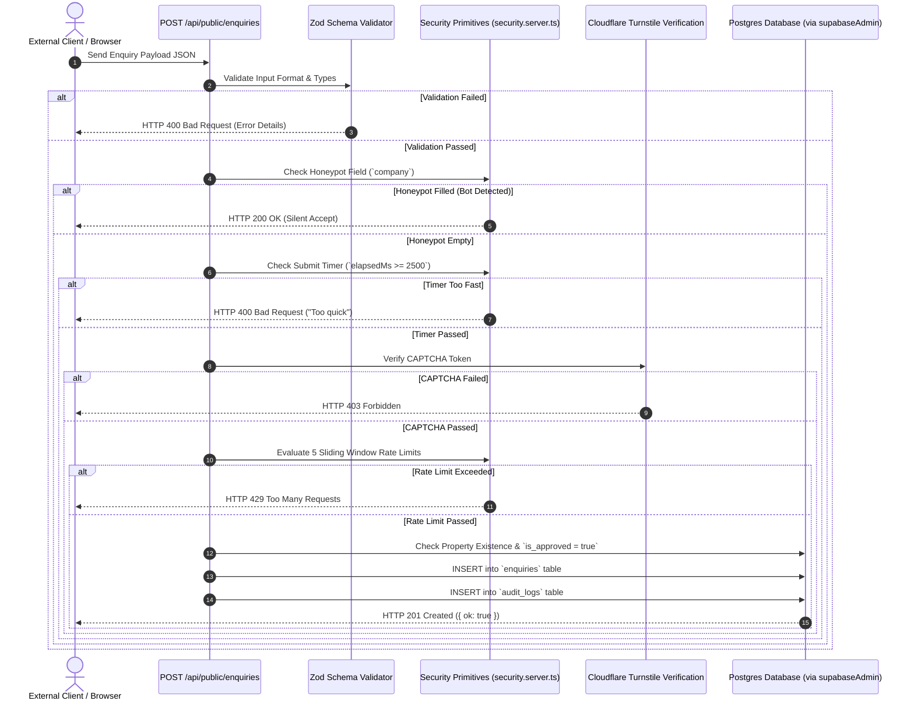
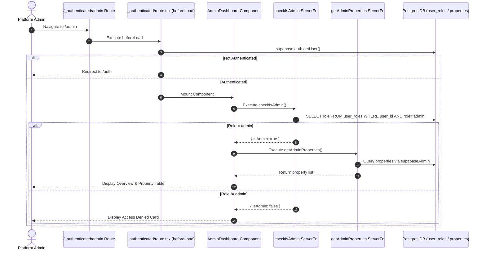
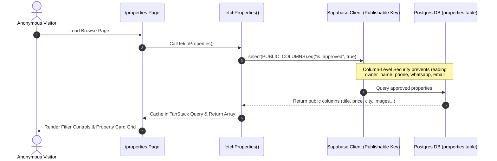

# Urban Rental Flats (URF) — Platform Architecture

## High-Level Architecture

Urban Rental Flats is designed as a full-stack, modular, API-first platform built on **TanStack Start** (React 19 + Vite 8 + Nitro) and **Supabase** (Postgres + Auth).



---

## Architecture Layers

```text
  UI Layer                src/routes/*, src/components/*
        │
  Feature Switchboard     src/config/features.ts     ← Modular feature flags
  RBAC Model              src/config/rbac.ts         ← Role & permission mapping
  Platform Config         src/config/platform.ts     ← Cities, locales, SKUs
        │
  Domain Contracts        src/lib/*.ts               ← Client-safe Zod contracts & query fetchers
  Server-Only Libs        src/lib/*.server.ts        ← Privileged admin & security primitives
        │
  API Surface             src/routes/api/public/*    ← External/unauthenticated REST routes
                          createServerFn             ← App-internal RPC functions
        │
  Data & Security         Postgres + RLS + CLS (Supabase)
```

---

## Rendering Strategy (SSR vs CSR)

- **Server-Side Rendering (SSR)**: Handled by TanStack Start via Nitro engine (`src/server.ts`). Initial HTML is pre-rendered with head metadata, OpenGraph tags, canonical links, and `Residence` JSON-LD structured data.
- **Client-Side Hydration (CSR)**: React 19 hydrates client-side navigation. Subsequent page transitions use TanStack Router client-side routing and TanStack Query state caching.
- **Dynamic Loaders**: Route `loader` functions (`properties.$id.tsx`) use `context.queryClient.ensureQueryData` to fetch data during SSR pre-rendering.

---

## Authentication Architecture & Diagram

Authentication utilizes Supabase Auth with JWT access tokens passed via HTTP `Authorization: Bearer <token>` headers.



---

## API Architecture & Diagram

Public API endpoints handle data validation and multi-layered anti-abuse enforcement before persisting data via the Supabase Service Role client.



---

## Admin Dashboard Architecture & Diagram

Admin access is protected by double-verification: session check in route layout and role query in `user_roles`.



---

## Property Listing Flow & Diagram

Public property browsing enforces Column-Level Security (CLS) to prevent exposure of owner contact data.



---

## Folder Architecture

```text
src/
├── config/             # Platform Switchboard, Feature Flags, RBAC Matrix
├── integrations/       # Supabase Client/Server connectors, Auth Middleware
├── lib/                # Domain models, security primitives, server functions
├── components/         # Brand components, Property cards, UI primitives (Radix)
└── routes/             # TanStack Router pages, layouts, REST endpoints
```
