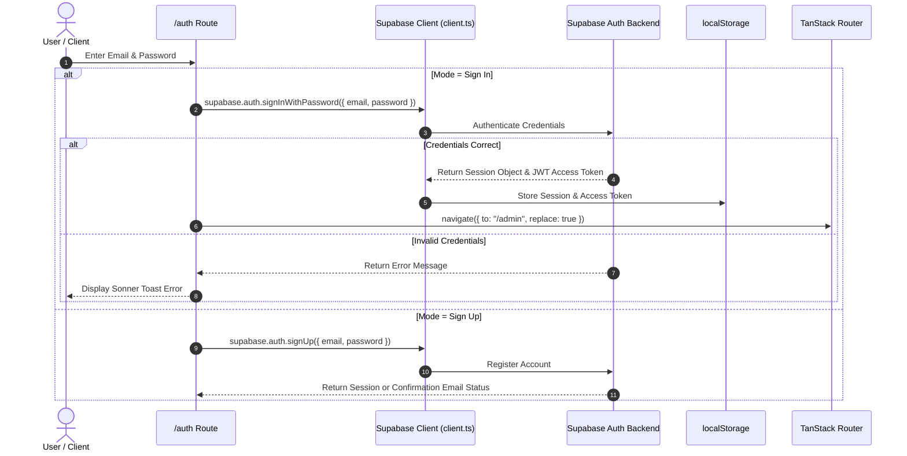
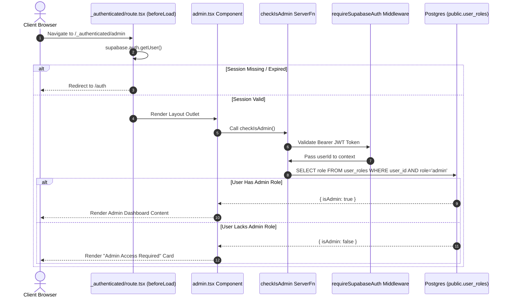

# Urban Rental Flats (URF) — Authentication & Security Architecture

## Authentication Overview

Urban Rental Flats utilizes **Supabase Auth** for identity management. Users authenticate via Email and Password, receiving a signed JSON Web Token (JWT) that is stored client-side in browser `localStorage` and attached to server function calls.

---

## Authentication Sequence Diagram

---

## JWT Lifecycle & Session Management

1. **Issuance**: Upon successful authentication, Supabase Auth issues an RS256-signed JWT containing user metadata (`sub` = User UUID, `email`, `role`, `exp`).
2. **Client Persistence**: `client.ts` configures `auth.storage` to use `window.localStorage` with `autoRefreshToken: true` and `persistSession: true`.
3. **RPC Transmission**: `auth-attacher.ts` intercepts all outgoing TanStack Start `createServerFn` RPC calls, fetches the current session access token via `supabase.auth.getSession()`, and attaches it as `Authorization: Bearer <token>`.
4. **Server Validation**: `auth-middleware.ts` (`requireSupabaseAuth`) extracts the token on the server, verifies its signature via `supabase.auth.getClaims(token)`, extracts `data.claims.sub`, and attaches an authenticated Supabase client and `userId` to the function context.

---

## Protected Routes & Authorization Architecture

---

## Role-Based Access Control (RBAC) System

Roles and permissions are defined in `src/config/rbac.ts`:

- **Roles**: `guest`, `customer`, `owner`, `agent`, `builder`, `admin`.
- **Permissions**: `property:browse`, `property:enquire`, `property:save`, `property:create`, `property:edit_own`, `property:edit_any`, `property:publish`, `property:approve`, `property:verify`, `enquiry:read_own`, `enquiry:read_any`, `user:manage`, `audit:read`, `analytics:read_platform`, etc.
- **Role Verification**: Persistent roles are stored in `public.user_roles` (`user_id`, `role`). Server function `checkIsAdmin` queries `user_roles` where `role = 'admin'`.

---

## Security Primitives & Protections

### 1. Cloudflare Turnstile CAPTCHA
- **File**: `src/lib/security.server.ts: verifyTurnstile()`
- **Mechanism**: Verifies CAPTCHA tokens submitted with enquiry forms against `https://challenges.cloudflare.com/turnstile/v0/siteverify`.
- **Behavior**: If `TURNSTILE_SECRET_KEY` is not provisioned, Turnstile operates as a no-op (returns `{ ok: true, configured: false }`), ensuring the platform runs without breaking during early development.

### 2. Postgres Sliding-Window Rate Limiting
- **File**: `src/lib/security.server.ts: checkRateLimits()`
- **Engine**: Evaluates 5 sliding window rules sequentially against Postgres counts:
  - Burst limit: Max 2 submissions per 60 seconds per IP.
  - Hourly limit: Max 6 submissions per 3600 seconds per IP.
  - Daily limit: Max 20 submissions per 86400 seconds per IP.
  - Per-property daily limit: Max 2 submissions per 86400 seconds per IP + property.
  - Per-phone daily limit: Max 10 submissions per 86400 seconds per phone number.

### 3. Honeypot & Timing Protections
- **Honeypot**: Hidden `company` input field in form. If filled by automated bots, the server logs an audit event and returns a dummy HTTP 200 success response so bots receive no negative signal.
- **Timer Check**: Rejects form submissions completed in under `MIN_SUBMIT_MS = 2500` (2.5 seconds).

### 4. Audit Logging
- **File**: `src/lib/security.server.ts: recordAudit()`
- **Persistence**: Writes event logs (`enquiry.created`, `enquiry.rejected`, `enquiry.rate_limited`) to `public.audit_logs` table via `supabaseAdmin` service role client.
- **Privacy**: `audit_logs` table is protected by a deny-all RLS policy (`USING (false)`), making it accessible exclusively to administrators.
