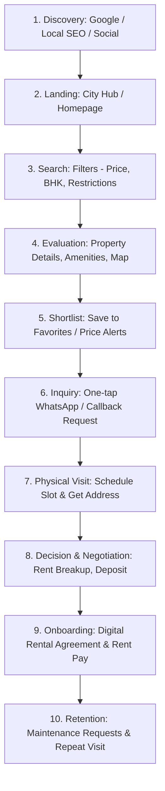

# Seedha Properties — End-to-End Customer Journey Blueprint

> **Author**: Senior Product Manager & UX Architect  
> **Target Persona**: Tenant / Rent Seeker (Students, Young Professionals, Families in Tier-2/3 India)

---

## 1. Complete Customer Journey Lifecycle

---

## 2. Granular Step-by-Step Touchpoint Analysis

### Step 1: Discovery & Entry

- **User Intent**: Tenant searches `"2 BHK flat for rent in Malviya Nagar Jaipur"` or `"Single room near Allen Coaching Kota"`.
- **Current URF Capability**: Organic traffic lands on `/properties` or homepage `/`. Dynamic meta tags generate canonical URLs.
- **Friction**: Lacks dedicated programmatic landing pages per city/area (e.g. `/rent-flats-in-jaipur/malviya-nagar`).
- **Recommendation**: Create city and micro-location landing pages loaded with local trust signals and FAQ schemas.

### Step 2: Search & Filtering

- **User Intent**: Filter properties by budget (₹8,000–₹15,000), furnishing status (Fully Furnished), and tenant preferences (Bachelors Allowed).
- **Current URF Capability**: URL query-driven state search (`/properties?q=&city=&listing=&minPrice=&maxPrice=&beds=`).
- **Friction**: Lacks quick toggle pills for "Bachelors", "Families Only", "Pets Allowed", or "Zero Deposit".
- **Recommendation**: Introduce tenant preference pills directly in the filter drawer without modifying existing layout tokens.

### Step 3: Property Detail Evaluation

- **User Intent**: Inspect property photos, verify rent deposit breakdown, check distance to college/office.
- **Current URF Capability**: Clean detail view at `/properties/$id` with image carousel, stats grid, and amenity tags.
- **Friction**: Rent breakdown is presented as a single monthly figure; deposit amount and maintenance charges are not itemized.
- **Recommendation**: Add structured fields for Monthly Rent, Security Deposit, and Maintenance Fee.

### Step 4: Owner Contact & Visit Scheduling

- **User Intent**: Connect directly with the owner to confirm availability and schedule an in-person visit.
- **Current URF Capability**: Form dialog requesting contact details, protected by Cloudflare Turnstile.
- **Friction**: Requires filling 4 form fields; no direct WhatsApp redirection.
- **Recommendation**: Add a prominent 🟢 **"Chat on WhatsApp"** button alongside the standard inquiry form.

### Step 5: Post-Visit Agreement & Onboarding

- **User Intent**: Finalize terms, sign a legal rental agreement, and pay initial token amount.
- **Current URF Capability**: Not implemented in current frontend state.
- **Friction**: Renters must navigate offline physical stamp paper purchasing and broker negotiations.
- **Recommendation**: Provide a 100% digital Rental Agreement generator inside the tenant dashboard.

---

## 3. Customer Retention & Re-engagement Mechanics

1. **Automated Saved Search Alerts**: Email/SMS notification when a new matching property is posted in their target neighborhood.
2. **Price Drop Notifications**: Alert shortlisted users when a favorite property reduces its rent price.
3. **Rent Payment Receipts**: Monthly digital rent receipt generator for HRA tax exemption claims.
