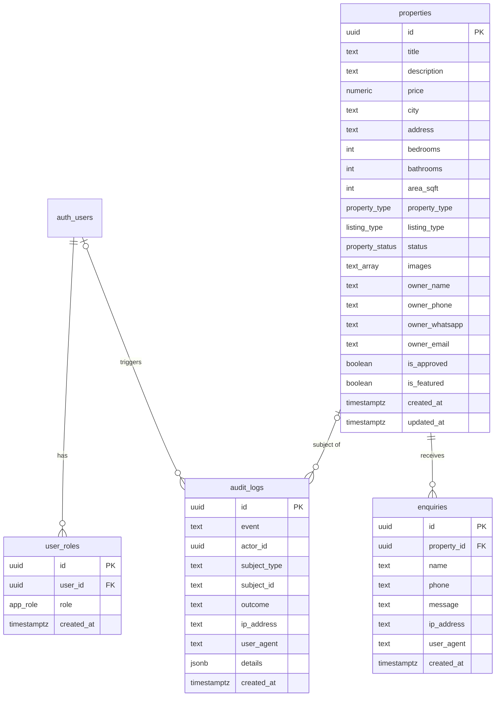

# Seedha Properties — Database Specification & Schema

## Entity-Relationship (ER) Diagram



---

## Custom Database Enums

```sql
CREATE TYPE public.property_type AS ENUM ('apartment', 'house', 'villa', 'studio', 'penthouse');
CREATE TYPE public.listing_type AS ENUM ('rent', 'sale');
CREATE TYPE public.property_status AS ENUM ('available', 'rented', 'sold');
CREATE TYPE public.app_role AS ENUM ('admin', 'moderator', 'user');
```

---

## Complete Table Specifications

### 1. `public.properties` Table

| Column           | Data Type                | Constraints | Default             | Description                         |
| ---------------- | ------------------------ | ----------- | ------------------- | ----------------------------------- |
| `id`             | `UUID`                   | PRIMARY KEY | `gen_random_uuid()` | Unique property identifier          |
| `title`          | `TEXT`                   | NOT NULL    | -                   | Property title                      |
| `description`    | `TEXT`                   | NOT NULL    | -                   | Full property description           |
| `price`          | `NUMERIC(12,2)`          | NOT NULL    | -                   | Rent/sale price in INR              |
| `city`           | `TEXT`                   | NOT NULL    | -                   | City location                       |
| `address`        | `TEXT`                   | NOT NULL    | -                   | Street address                      |
| `bedrooms`       | `INT`                    | NOT NULL    | `0`                 | Number of bedrooms (BHK)            |
| `bathrooms`      | `INT`                    | NOT NULL    | `0`                 | Number of bathrooms                 |
| `area_sqft`      | `INT`                    | NOT NULL    | `0`                 | Floor area in sq. ft.               |
| `property_type`  | `public.property_type`   | NOT NULL    | `'apartment'`       | Type of property                    |
| `listing_type`   | `public.listing_type`    | NOT NULL    | `'rent'`            | Rent or sale                        |
| `status`         | `public.property_status` | NOT NULL    | `'available'`       | Listing availability status         |
| `images`         | `TEXT[]`                 | NOT NULL    | `'{}'`              | Array of image URLs                 |
| `owner_name`     | `TEXT`                   | NOT NULL    | -                   | Owner full name (CLS Restricted)    |
| `owner_phone`    | `TEXT`                   | NOT NULL    | -                   | Owner phone number (CLS Restricted) |
| `owner_whatsapp` | `TEXT`                   | NULLABLE    | -                   | Owner WhatsApp contact              |
| `owner_email`    | `TEXT`                   | NULLABLE    | -                   | Owner email contact                 |
| `is_approved`    | `BOOLEAN`                | NOT NULL    | `true`              | Admin approval status               |
| `is_featured`    | `BOOLEAN`                | NOT NULL    | `false`             | Homepage featured status            |
| `created_at`     | `TIMESTAMPTZ`            | NOT NULL    | `now()`             | Creation timestamp                  |
| `updated_at`     | `TIMESTAMPTZ`            | NOT NULL    | `now()`             | Last modification timestamp         |

#### Indexes:

- `properties_city_idx`: ON `public.properties(city)`
- `properties_price_idx`: ON `public.properties(price)`
- `properties_bedrooms_idx`: ON `public.properties(bedrooms)`
- `properties_listing_type_idx`: ON `public.properties(listing_type)`

#### Triggers & Functions:

- `update_properties_updated_at`: `BEFORE UPDATE ON public.properties FOR EACH ROW EXECUTE FUNCTION public.update_updated_at_column()`

---

### 2. `public.enquiries` Table

| Column        | Data Type     | Constraints                              | Default             | Description               |
| ------------- | ------------- | ---------------------------------------- | ------------------- | ------------------------- |
| `id`          | `UUID`        | PRIMARY KEY                              | `gen_random_uuid()` | Unique enquiry identifier |
| `property_id` | `UUID`        | FK -> `properties(id)` ON DELETE CASCADE | -                   | Targeted property listing |
| `name`        | `TEXT`        | NOT NULL                                 | -                   | Customer full name        |
| `phone`       | `TEXT`        | NOT NULL                                 | -                   | Customer phone number     |
| `message`     | `TEXT`        | NOT NULL                                 | -                   | Customer enquiry message  |
| `ip_address`  | `TEXT`        | NULLABLE                                 | -                   | Client IP address         |
| `user_agent`  | `TEXT`        | NULLABLE                                 | -                   | Client browser user agent |
| `created_at`  | `TIMESTAMPTZ` | NOT NULL                                 | `now()`             | Submission timestamp      |

#### Indexes:

- `enquiries_ip_created_idx`: ON `public.enquiries (ip_address, created_at DESC)`
- `enquiries_property_created_idx`: ON `public.enquiries (property_id, created_at DESC)`

---

### 3. `public.audit_logs` Table

| Column         | Data Type     | Constraints | Default             | Description                       |
| -------------- | ------------- | ----------- | ------------------- | --------------------------------- |
| `id`           | `UUID`        | PRIMARY KEY | `gen_random_uuid()` | Log entry ID                      |
| `event`        | `TEXT`        | NOT NULL    | -                   | Event identifier string           |
| `actor_id`     | `UUID`        | NULLABLE    | -                   | User ID performing action         |
| `subject_type` | `TEXT`        | NULLABLE    | -                   | Entity type (e.g. `property`)     |
| `subject_id`   | `TEXT`        | NULLABLE    | -                   | Entity ID                         |
| `outcome`      | `TEXT`        | NOT NULL    | `'success'`         | `success`, `rejected`, or `error` |
| `ip_address`   | `TEXT`        | NULLABLE    | -                   | Originating IP address            |
| `user_agent`   | `TEXT`        | NULLABLE    | -                   | Originating User-Agent            |
| `details`      | `JSONB`       | NOT NULL    | `'{}'::jsonb`       | Additional metadata JSON          |
| `created_at`   | `TIMESTAMPTZ` | NOT NULL    | `now()`             | Event timestamp                   |

#### Indexes:

- `audit_logs_event_created_idx`: ON `public.audit_logs (event, created_at DESC)`
- `audit_logs_ip_created_idx`: ON `public.audit_logs (ip_address, created_at DESC)`

---

### 4. `public.user_roles` Table

| Column       | Data Type         | Constraints                              | Default             | Description                                  |
| ------------ | ----------------- | ---------------------------------------- | ------------------- | -------------------------------------------- |
| `id`         | `UUID`            | PRIMARY KEY                              | `gen_random_uuid()` | Role assignment ID                           |
| `user_id`    | `UUID`            | FK -> `auth.users(id)` ON DELETE CASCADE | -                   | Target Supabase Auth User ID                 |
| `role`       | `public.app_role` | NOT NULL                                 | -                   | Assigned role (`admin`, `moderator`, `user`) |
| `created_at` | `TIMESTAMPTZ`     | NOT NULL                                 | `now()`             | Grant timestamp                              |

#### Constraints:

- `UNIQUE (user_id, role)`

---

## Row-Level Security (RLS) & Column-Level Security (CLS)

### `public.properties`:

- **RLS Policy**: `"Public can view approved properties"` `ON public.properties FOR SELECT TO anon, authenticated USING (is_approved = true)`.
- **Column-Level Security (CLS)**:
  ```sql
  REVOKE SELECT ON public.properties FROM anon, authenticated;

  GRANT SELECT (
    id, title, description, price, city, address, bedrooms, bathrooms,
    area_sqft, property_type, listing_type, status, images,
    is_approved, is_featured, created_at, updated_at
  ) ON public.properties TO anon, authenticated;
  ```
  _Result_: Owner contact columns (`owner_name`, `owner_phone`, `owner_whatsapp`, `owner_email`) cannot be queried by `anon` or `authenticated` roles.

### `public.enquiries` & `public.audit_logs`:

- **Deny-All Client RLS Policy**:
  ```sql
  CREATE POLICY "No client access to enquiries" ON public.enquiries FOR ALL TO anon, authenticated USING (false) WITH CHECK (false);
  CREATE POLICY "No client access to audit logs" ON public.audit_logs FOR ALL TO anon, authenticated USING (false) WITH CHECK (false);
  ```
  _Result_: Accessible exclusively via `service_role` (Supabase Admin client).

### `public.user_roles`:

- **RLS Policy**: `"Users can view their own roles"` `ON public.user_roles FOR SELECT TO authenticated USING (auth.uid() = user_id)`.

---

## Database Functions

### `public.has_role(_user_id uuid, _role public.app_role)`

- **Language**: `SQL STABLE SECURITY DEFINER`
- **Permissions**: `REVOKE ALL FROM PUBLIC, anon, authenticated; GRANT EXECUTE TO service_role;`
- **Body**:
  ```sql
  SELECT EXISTS (
    SELECT 1 FROM public.user_roles
    WHERE user_id = _user_id AND role = _role
  );
  ```

---

## Domain Entity Lifecycles

### Property Lifecycle

1. **Creation**: Inserted into `properties` table with `is_approved = true` (or `false` for pending moderation) and `status = 'available'`.
2. **Browsing**: Queryable by public users if `is_approved = true`.
3. **Featured**: Toggled via Admin UI (`is_featured = true`) to appear in homepage hero carousel.
4. **Status Change**: Status transitions from `available` -> `rented` or `sold`.

### Customer Enquiry Lifecycle

1. **Submission**: Received via `POST /api/public/enquiries`.
2. **Anti-Abuse Verification**: Validates honeypot, form submission timer, Cloudflare Turnstile, and Postgres sliding window rate limits.
3. **Persistence**: Written to `enquiries` table via `supabaseAdmin` service role.
4. **Admin Review**: Platform administrators view leads in the Admin Dashboard Enquiries tab.

### User Lifecycle

1. **Registration**: User signs up via `/auth` route (`supabase.auth.signUp`).
2. **Authentication**: Sign in returns JWT access token (`supabase.auth.signInWithPassword`).
3. **Role Assignment**: Row inserted into `public.user_roles` linking `user_id` to `admin` role.
4. **Role Check**: `checkIsAdmin` server function queries `user_roles` to grant access to admin RPC endpoints.
