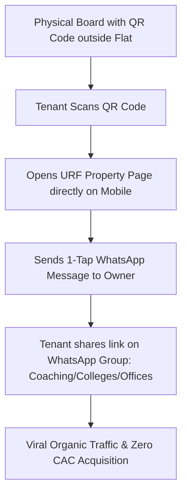

# Seedha Properties — Tier-2/3 SEO & Local Growth Engine Strategy

> **Author**: Lead SEO Specialist & Growth Marketer  
> **Primary Acquisition Strategy**: Programmatic Tier-2/3 City SEO, WhatsApp Viral Loops, & Hyper-Local Community Growth

---

## 1. Programmatic SEO Engine Architecture

In Indian real estate, organic Google search accounts for 65%+ of zero-cost tenant acquisition. URF's SEO strategy leverages TanStack Start SSR metadata generation and Nitro dynamic dynamic XML sitemaps (`src/routes/sitemap[.]xml.ts`).

```
┌──────────────────────────────────────────────────────────────────────────┐
│                      PROGRAMMATIC SEO URL STRUCTURE                      │
├──────────────────────────────────────────────────────────────────────────┤
│ Base Template: /rent-flats-in-[city]/[neighborhood]                      │
├──────────────────────────────────────────────────────────────────────────┤
│ Examples:                                                                │
│  - /rent-flats-in-jaipur/malviya-nagar                                   │
│  - /rent-flats-in-lucknow/gomti-nagar                                    │
│  - /rent-flats-in-indore/vijay-nagar                                     │
│  - /rent-flats-in-chandigarh/sector-17                                  │
│  - /rent-flats-in-coimbatore/peelamedu                                   │
└──────────────────────────────────────────────────────────────────────────┘
```

---

## 2. Structured Schema.org Implementation

To capture Google Rich Snippets and Carousel cards, every property page injects structured JSON-LD data:

```html
<script type="application/ld+json">
  {
    "@context": "https://schema.org",
    "@type": "RealEstateListing",
    "name": "Spacious 2 BHK Flat in Malviya Nagar",
    "description": "2 BHK rental flat with modern amenities in Jaipur",
    "url": "https://seedhaproperties.com/properties/prop-123",
    "datePosted": "2026-08-01",
    "price": "18000",
    "priceCurrency": "INR",
    "address": {
      "@type": "PostalAddress",
      "addressLocality": "Jaipur",
      "addressRegion": "Rajasthan",
      "addressCountry": "IN"
    }
  }
</script>
```

---

## 3. Social Sharing & Open Graph Optimization

Meta head configurations generate dynamic Open Graph images and Twitter summary cards:

```typescript
// Verified in src/config/app.ts & src/routes/index.tsx
export const getOgImageUrl = (title?: string, price?: number) => {
  const params = new URLSearchParams();
  if (title) params.set("title", title);
  if (price) params.set("price", `₹${price.toLocaleString("en-IN")}`);
  return `https://seedhaproperties.com/api/og?${params.toString()}`;
};
```

---

## 4. Hyper-Local Growth Loops for Tier-2/3 Cities



### Local Growth Levers:

1. **Free "To Let" Board Flyers for Owners**: Supply physical yellow board templates containing printable QR codes linking to their URF listing.
2. **Coaching & College Hub Partnerships**: Partner with student unions and coaching institutes in Tier-2 hubs (e.g. Kota, Jaipur, Indore, Prayagraj) for direct PG/flat recommendations.
3. **WhatsApp Community Groups**: Broadcast daily new verified listings to city-specific WhatsApp groups ("Jaipur Flat & Flatmates", "Lucknow Rentals").

---

## 5. SEO Key Performance Indicators (KPI Targets)

| SEO Metric                          | Month 3 Target | Month 6 Target | Month 12 Target  |
| :---------------------------------- | :------------: | :------------: | :--------------: |
| **Indexed Organic Pages**           |     1,500      |     10,000     |     50,000+      |
| **Organic Monthly Traffic**         |     25,000     |    150,000     |     750,000      |
| **Top-3 Keyword Rankings**          |    50 terms    |   400 terms    |   2,500 terms    |
| **Customer Acquisition Cost (CAC)** |  ₹120 / lead   |   ₹45 / lead   | **< ₹15 / lead** |
