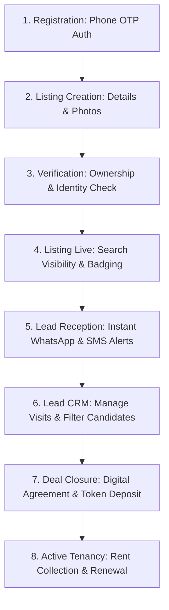

# Urban Rental Flats (URF) — Property Owner Journey & Listing Management Audit

> **Author**: Senior Product Manager & Real Estate Domain Expert  
> **Target Persona**: Property Owner (Individual Flat Owners, Independent House Owners, Multi-unit Landlords in Tier-2/3 India)  

---

## 1. Property Owner Lifecycle Architecture

---

## 2. Granular Step-by-Step Owner Experience Evaluation

### Step 1: Property Upload & Listing Creation
- **Current State**: Property listing forms exist within the admin dashboard routing, taking fields for Title, Description, Price, Location, City, Beds, Baths, Sqft, Amenities, and Image URLs.
- **Evaluation & Gaps**:
  - Image upload currently relies on entering image URLs directly or basic storage bucket uploading.
  - Lacks multi-file drag-and-drop photo uploader with image order sorting and automatic cover photo selection.
  - Lacks auto-save draft functionality (owners frequently get interrupted while typing listing descriptions).
- **Required Recommendation**:
  - Add auto-save to `localStorage` for incomplete listing drafts.
  - Integrate Supabase Storage client-side multi-file uploader with image optimization.

### Step 2: Verification & Platform Badging
- **Current State**: Listings can be marked as `is_verified` or `is_featured` in Supabase `properties` database schema.
- **Evaluation & Gaps**:
  - Lacks automated document submission (Electricity Bill, Registry Copy, PAN) for owner identity validation.
  - Owners who complete verification should receive a prominent green **"Verified Owner — 0% Brokerage"** badge.

### Step 3: Lead Management & CRM Dashboard
- **Current State**: Owner inquiries are saved in Supabase database tables (`inquiries`), but owner-specific filtering is unified under admin views.
- **Evaluation & Gaps**:
  - Owners lack a dedicated mobile-friendly lead inbox to:
    1. View lead names, phone numbers, and tenant profiles (Family vs. Bachelors).
    2. One-click call or WhatsApp the inquiring tenant.
    3. Update lead status (`Inquired` → `Visit Scheduled` → `Rented`).
- **Required Recommendation**:
  - Create a dedicated `/dashboard/owner` view displaying lead metrics, listing views, inquiry status, and quick tenant contact buttons.

### Step 4: Digital Tools for Owners (QR Code & Sharing)
- **Current State**: Property URLs are canonical (`/properties/$id`).
- **Evaluation & Gaps**:
  - Owners frequently place "To Let" physical boards outside their buildings in Tier-2/3 cities.
  - Generating a printable **Property QR Code Flyer** directly from the owner dashboard enables physical-to-digital conversion.
- **Required Recommendation**:
  - Add a "Download Printable To-Let Poster with QR Code" button in the owner listing card.

---

## 3. Owner Retention & Monetization Strategy

1. **Free Basic Listing**: 1 free listing per registered owner to maximize supply volume.
2. **Featured Listing Upgrade**: ₹499 for 30 days top-of-search placement + social media boost.
3. **Tenant Background Verification Package**: ₹299 per tenant (Aadhaar, PAN, & police verification assistance).

