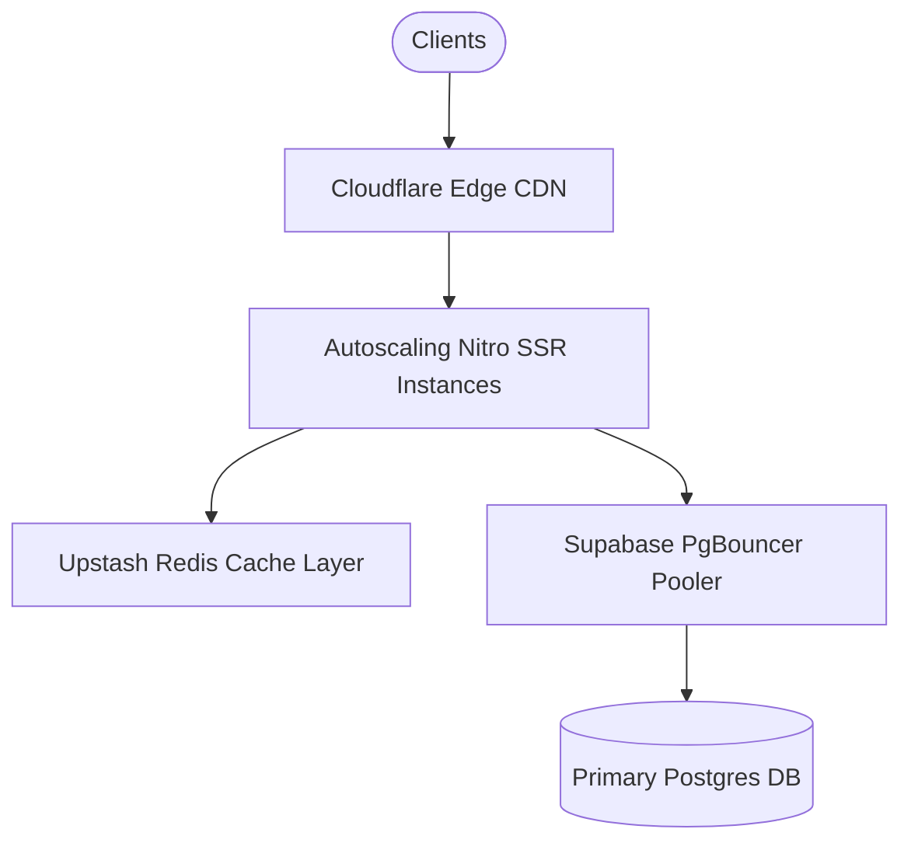
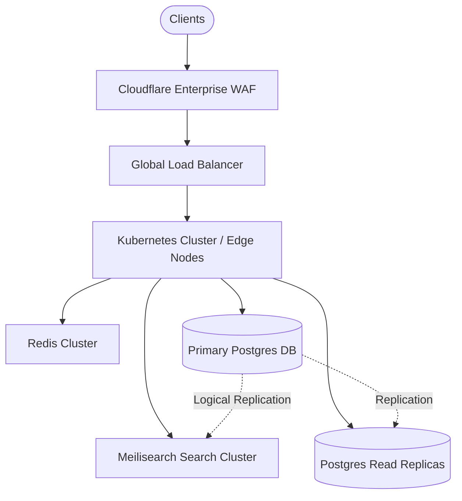

# Urban Rental Flats (URF) — Multi-Tier Scaling Roadmap

> **Document Type:** Infrastructure & Architecture Scaling Blueprint  
> **Repository:** `property-pioneer-dev`  
> **Target Milestones:** MVP (1K) -> Regional Scale (10K) -> National Scale (100K) -> Enterprise Scale (1M Users)

---

## Executive Overview

This document outlines the architectural evolution required to scale Urban Rental Flats (URF) seamlessly from its initial launch to serving over 1,000,000 active daily users while maintaining sub-100ms response times and 99.99% system availability.

---

## 1. Scale Stage 1: MVP Baseline (1,000 Active Users)

### Infrastructure:

- **Server**: Single Node.js Nitro runner on cloud instance (Render/Vercel/Fly.io).
- **Database**: Single primary Supabase Postgres instance (Shared tier).
- **Caching**: In-memory React Query caching on client browser.

### Bottlenecks & Solved Items:

- Resolved client-side filtering by implementing server-side pagination (`.range()`).
- Resolved late admin authorization by moving role checks to route `beforeLoad`.

### Performance SLAs:

- **P95 Latency**: <150ms
- **Availability**: 99.5%
- **Monthly Infra Cost**: ~$25 - $50

---

## 2. Scale Stage 2: Regional Growth (10,000 Active Users)

### Infrastructure Expansion:

### Technical Implementation:

1. **Connection Pooling**: Configure PgBouncer / Supavisor connection pooling in Transaction Mode to handle up to 500 concurrent connections.
2. **Redis Multi-Tier Cache**: Wrap public property list (`fetchProperties`) and detail (`fetchProperty`) fetchers with Redis caching (60s TTL).
3. **CDN Media Edge**: Route image requests through Cloudflare CDN with WebP image optimization edge rules (`w=600&q=80`).
4. **Database Indexing**: Enforce composite B-Tree indexes on `properties(city, is_approved, price)`.

### Performance SLAs:

- **P95 Latency**: <80ms (Cache hit: <15ms)
- **Availability**: 99.9%
- **Monthly Infra Cost**: ~$150 - $300

---

## 3. Scale Stage 3: National Scale (100,000 Active Users)

### Infrastructure Expansion:

### Technical Implementation:

1. **Database Read Replicas**: Provision 2 read-replica Postgres instances offloading read traffic from the primary write instance.
2. **Dedicated Full-Text Search Engine**: Deploy Meilisearch / Algolia cluster; index properties asynchronously using Postgres logical replication / triggers.
3. **Asynchronous Background Processing**: Offload audit logging, security alert dispatches, and email notifications to background worker queues (BullMQ / Redis).
4. **CDN Asset Hosting**: Migrate uploaded property photos to Cloudflare R2 / AWS S3 backed by CloudFront CDN.

### Performance SLAs:

- **P95 Latency**: <50ms
- **Availability**: 99.95%
- **Monthly Infra Cost**: ~$800 - $1,500

---

## 4. Scale Stage 4: Enterprise Dominance (1,000,000 Active Users)

### Infrastructure Architecture:

- **Microservices Transition**: Decompose monolithic SSR API layer into high-performance microservices:
  - **Auth & Identity Service**: Supabase Auth + Custom Go/Node RPC service.
  - **Search & Discovery Service**: Meilisearch / Elasticsearch cluster behind gRPC gateway.
  - **Lead & Anti-Abuse Service**: Rust/Go service handling rate limiting, honeypot, and Turnstile validation.
  - **Payment & Order Service**: Isolated financial transaction processing service.
- **Database Partitioning & Sharding**:
  - Partition `enquiries` and `audit_logs` tables by month (`RANGE (created_at)`).
  - Shard property databases by geographical state/region.
- **Event-Driven Architecture**: Kafka / RabbitMQ message bus handling event publishing (e.g. `listing.approved`, `lead.created`, `payment.completed`).
- **Global Multi-Region Deployment**: Multi-region Kubernetes clusters (AWS EKS / GCP GKE) running near end users in primary metropolitan hubs.

### Performance SLAs:

- **P95 Latency**: <30ms
- **Availability**: 99.99%
- **Monthly Infra Cost**: ~$4,000 - $8,000

---

## 5. Cost Optimization Strategy Matrix

| User Scale     | Dominant Cost Factor      | Optimization Lever                                                   |
| -------------- | ------------------------- | -------------------------------------------------------------------- |
| **1K Users**   | Database Host             | Use shared Supabase tier; client local storage caching.              |
| **10K Users**  | DB Connections            | PgBouncer connection pooling; Upstash Redis caching.                 |
| **100K Users** | Image CDN Bandwidth       | Cloudflare R2 zero-egress storage; automated WebP compression.       |
| **1M Users**   | Server Compute & DB Reads | Microservice edge deployment; read-replicas; Meilisearch offloading. |
