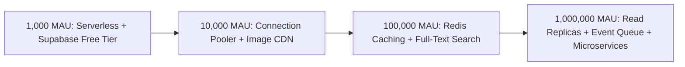

# Seedha Properties — Infrastructure & Startup Scaling Strategy

> **Author**: Staff Systems Architect & DevOps Lead  
> **Infrastructure Target**: Scaling from 1,000 to 1,000,000 Monthly Active Users (MAU)  
> **Deployment Target**: Vercel / Cloudflare Workers + Supabase PostgreSQL

---

## 1. Scale Progression & Bottleneck Matrix



---

## 2. Granular Infrastructure Milestones

### Scale Milestone 1: 1,000 Concurrent Users (Launch Phase)

- **Bottlenecks**: None. Nitro SSR serverless execution on Vercel/Cloudflare handles traffic effortlessly.
- **Database**: Supabase PostgreSQL single instance.
- **Caching**: HTTP browser cache (`stale-while-revalidate`) for property API responses.
- **Cost Estimate**: **$0 - $25 / month** (Free tier covering serverless compute & DB).

### Scale Milestone 2: 10,000 Concurrent Users (Growth Phase)

- **Bottlenecks**: PostgreSQL connection exhaustion during peak evening search hours (6 PM - 10 PM IST).
- **Architecture Upgrades**:
  1. **Connection Pooling**: Enable PgBouncer / Supabase Connection Pooler (`transaction` mode).
  2. **Image Optimization**: Cloudflare Images or ImageKit CDN for responsive image resizing and WebP conversion.
  3. **Database Indexing**: Add Composite Indexes on `properties (city, listing_type, price, beds)`.
- **Cost Estimate**: **$75 - $150 / month**.

### Scale Milestone 3: 100,000 Concurrent Users (Expansion Phase)

- **Bottlenecks**: Complex SQL `LIKE` searches causing CPU spikes on PostgreSQL. Slow search responses for micro-locations.
- **Architecture Upgrades**:
  1. **In-Memory Caching**: Introduce Upstash Redis for hot property details and city catalog caches.
  2. **Dedicated Full-Text Search**: Implement Meilisearch or Elasticsearch for instant fuzzy location search (`<50ms` latency).
  3. **Object Storage Offloading**: S3/Cloudflare R2 bucket storage with signed uploading URLs.
- **Cost Estimate**: **$400 - $800 / month**.

### Scale Milestone 4: 1,000,000+ Concurrent Users (National Leader Phase)

- **Bottlenecks**: Write lock contention during high-volume inquiry and lead creation.
- **Architecture Upgrades**:
  1. **PostgreSQL Read Replicas**: Separate primary database (writes) from read replicas (search queries).
  2. **Asynchronous Event Queue**: Apache Kafka or AWS SQS for lead notifications, SMS, and WhatsApp dispatchers.
  3. **Database Sharding**: Partition properties database tables by geographical zone (North India, South India, West India).
- **Cost Estimate**: **$3,500 - $7,000 / month**.

---

## 3. DevOps, Monitoring, & Disaster Recovery Setup

```
┌──────────────────────────────────────────────────────────────────────────┐
│                      OPERATIONAL MONITORING STACK                        │
├───────────────────┬───────────────────────────────┬──────────────────────┤
│ Domain            │ Technology / Service          │ SLA / Target         │
├───────────────────┼───────────────────────────────┼──────────────────────┤
│ Error Tracking    │ Sentry (Web & Node)           │ zero unhandled errors│
│ APM & Latency     │ Datadog / OpenTelemetry       │ p95 < 200ms          │
│ Uptime Monitoring │ BetterStack / UptimeRobot     │ 99.95% Uptime        │
│ Log Aggregation   │ Axiom / Cloudflare Logs       │ 30-day retention     │
│ DB Backups        │ Supabase Daily PitR           │ Point-in-time recovery│
└───────────────────┴───────────────────────────────┴──────────────────────┘
```

---

## 4. Security Hardening & Rate Limiting Guidelines

1. **API Rate Limiting**: Implement Cloudflare Web Application Firewall (WAF) limiting public search endpoints to 120 requests/minute per IP.
2. **Turnstile Bot Defense**: Maintain Turnstile CAPTCHA protection on auth (`/auth`) and contact forms (`/properties/$id`).
3. **Environment Security**: Enforce strict environment variable validation via Zod schemas at startup (`src/config/app.ts`).
